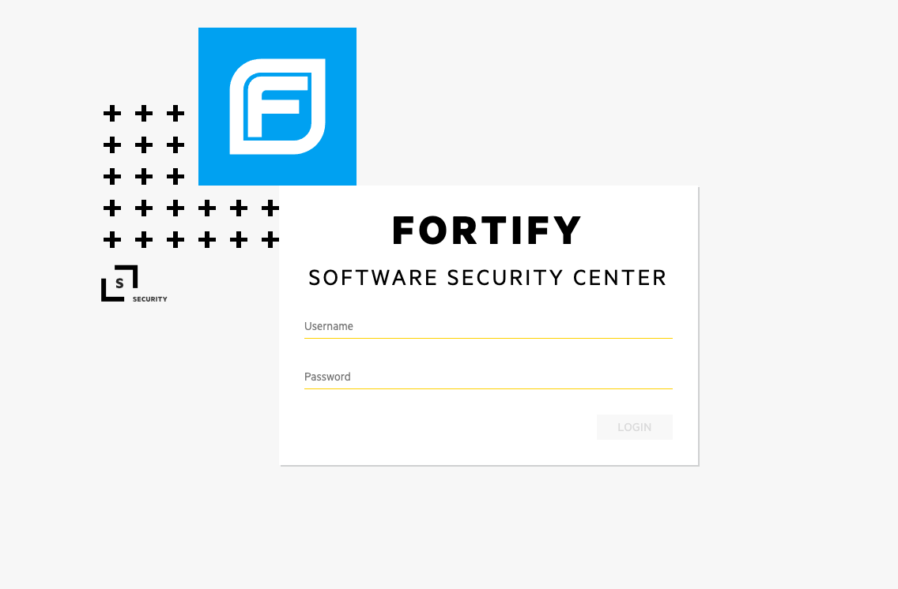
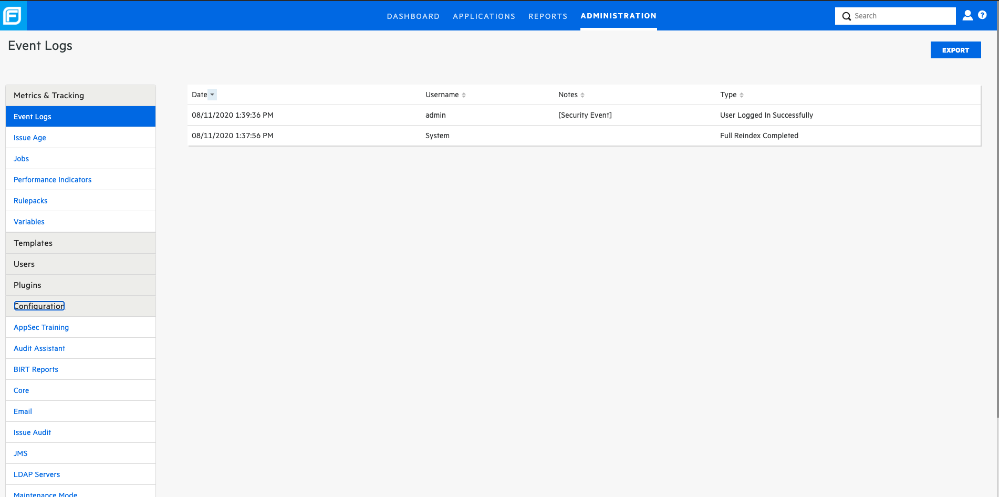
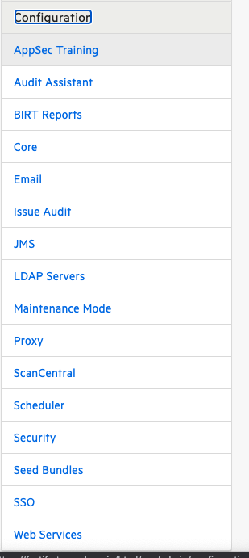
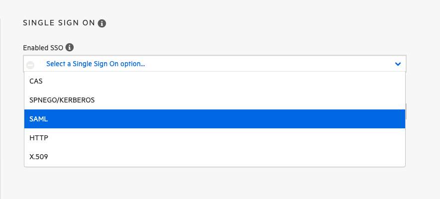
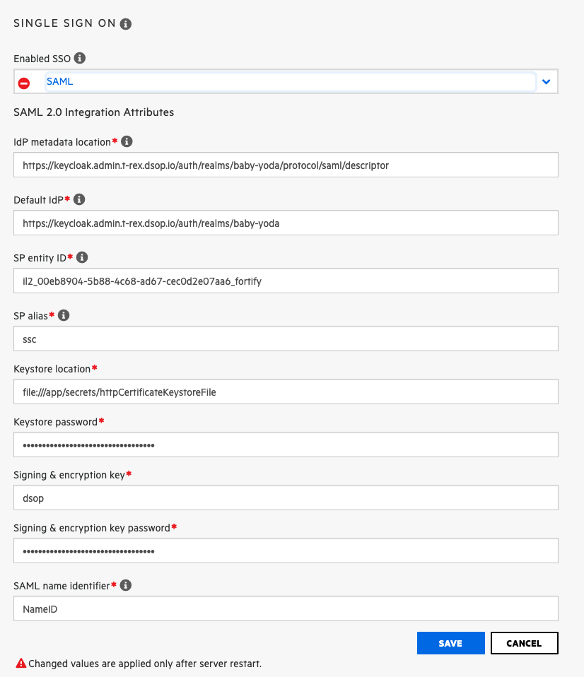
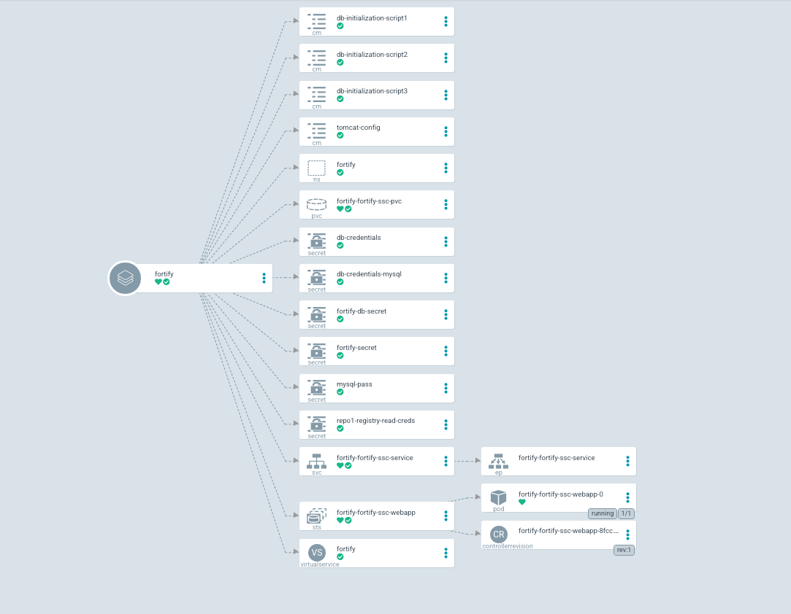
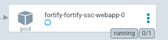

# Fortify App


## Pre Deployment Configuration

* How to create java keystore?
  * you need to create pkcs12 java keystore add certificate and key using openssl.
    
    * ```bash
      openssl pkcs12 -export -in <client-cert.pem> -inkey <client-key.pem> -out fortify-keystore.jks -name <Alias Name>
      ```
    
  * Validate certs in keystore
  
    * ```bash
      keytool -list -v -keystore fortify-keystore.jks
      ```

## Post Install Configuration

* **Prerequisites:**

  * Keycloak is available to fortify

    * Make sure you configure a valid redirect URL to

      `https://${FORTIFY_URL}/saml/SSO/alias/`

    * Make sure you configure a valid logout URL 

    * `saml_single_logout_service_url_post`: `http://`${FORTIFY_URL}/saml/SingleLogout/alias/ssc`

  * Keycloak realm metadata is available from keycloak. To verify please try follow below steps
    * `curl https://${KEYCLOAK_DNS}/auth/realms/${REALM_NAME}/protocol/saml`
    * with above command you should get a `200` response and also xml file with data to connect to IDP(Identity Provider(Keycloak))
    
  * Keystore password
    * secret name ref: 
      * Name: `fortify-secret`
      * Data: `httpCertificateKeystorePassword`
    
  * Certificate password
    * secret name ref: 
      * Name: `fortify-secret`
      * Data: `httpCertificateKeyPassword`

* **Post Configuration:**

  * Login into the Fortify web UI using the default user credentials `username/password: admin/admin`. It will prompt you to update your password immediately.

    

    

  * Complete login with new credentials

  * Now you need to setup SSO with SAML

  * Navigate to administration page and select configuration on left sidebar of the administration page.

    
  
  * Select SSO in the configuration section, it will show a drop down menu for SSO options.

    

  * From the drop down select SAML, by default most of the values are populated already.

    

  * set the keystore password and signing and encryption key.

    

  * Save the config.

  * Now go to argocd and kill the fortify pod.( Note: Just kill the pod to restart service and wait for approx:3 min).

    

    

  * Now try to access your fortify URL, it will redirect back to keycloak.
