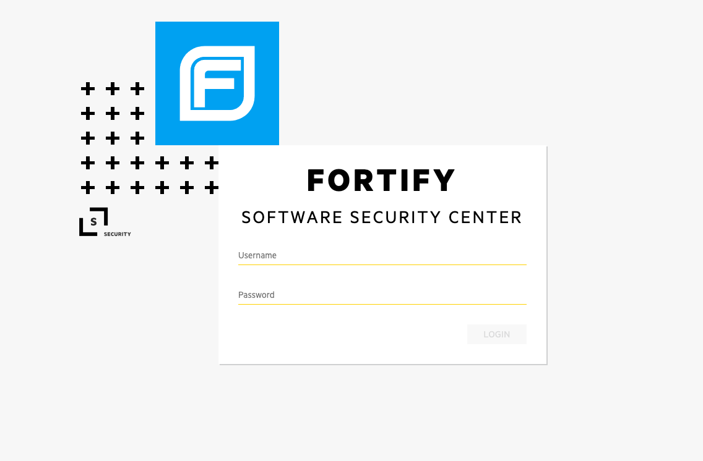
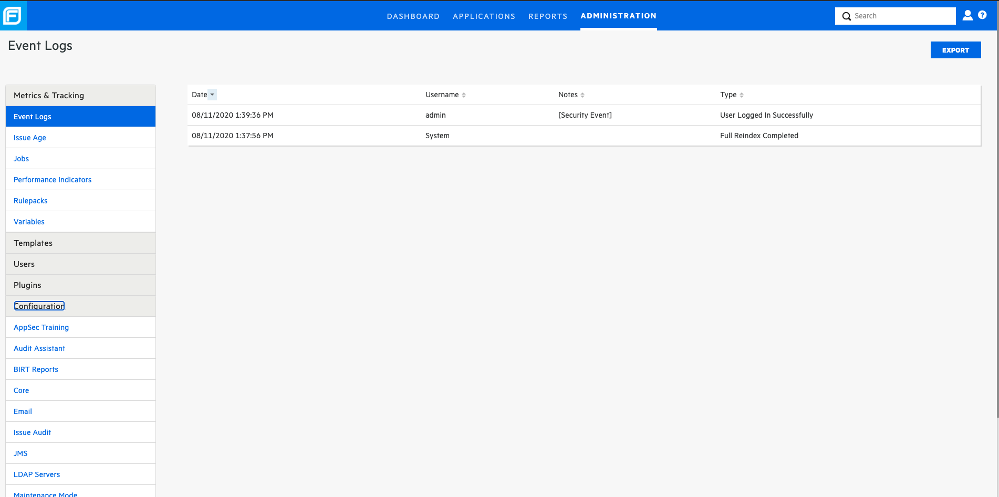
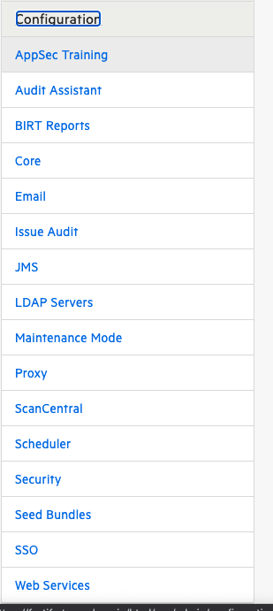
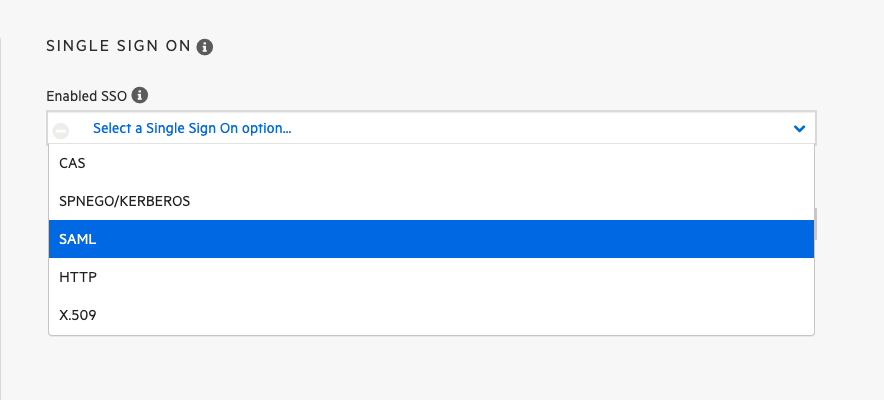
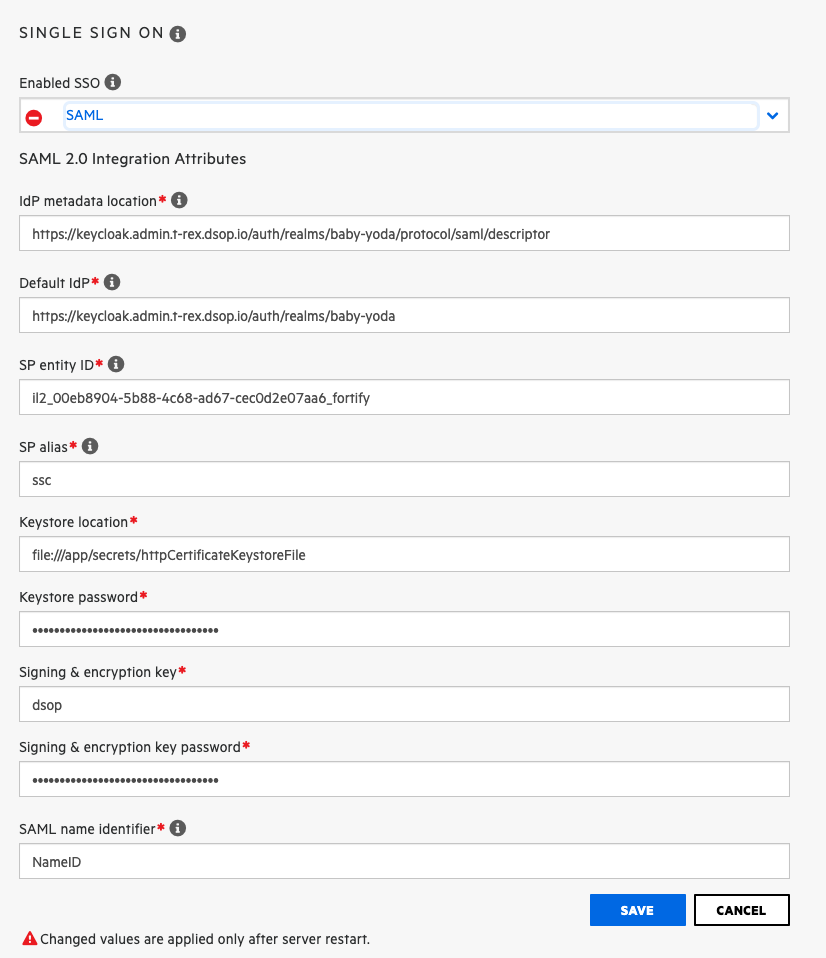
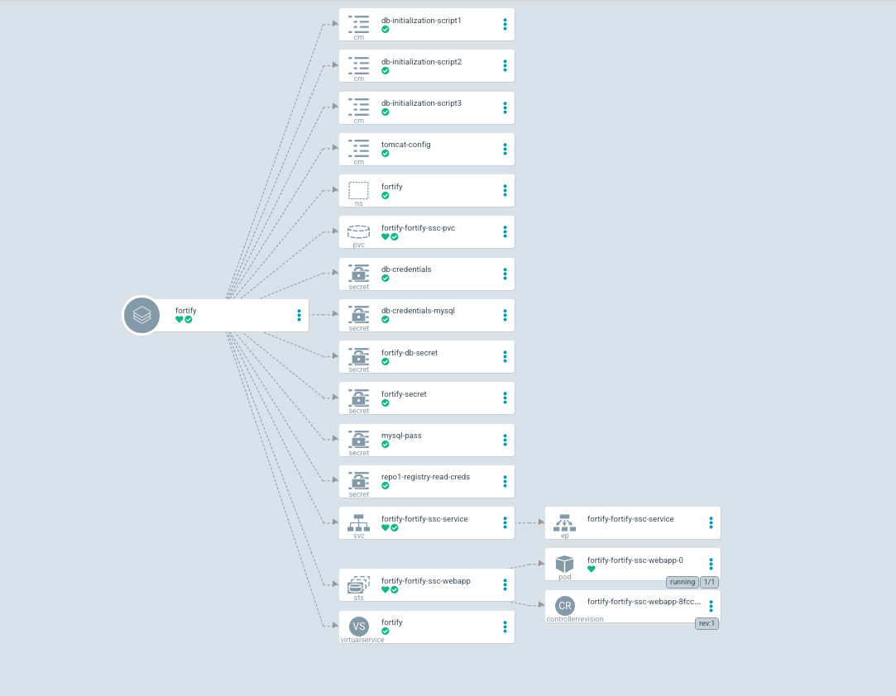
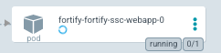

# Fortify App


## Pre Deployment Configuration

### Keystore Generation

As of version 25.2.2-bb.0, the keystore is **automatically generated** by a Kubernetes Job during installation. This Job:
- Runs as a Helm pre-install/pre-upgrade hook
- Generates a self-signed certificate for the Fortify HTTPS server
- Creates the required PKCS12 keystore
- Stores everything in a Kubernetes Secret (`fortify-ssc-secret`)

**Manual keystore creation is no longer required** unless you need to use custom certificates.

#### Using Custom Certificates (Optional)

If you need to provide your own certificates instead of the auto-generated ones:

1. Disable the automatic keystore generation:
   ```yaml
   keystoreJob:
     enabled: false
   ```

2. Create your keystore manually:
   ```bash
   openssl pkcs12 -export -in <client-cert.pem> -inkey <client-key.pem> -out fortify-keystore.jks -name tomcat
   ```

3. Create the secret manually with your keystore and configuration files

## Post Install Configuration

* **Prerequisites:**

  * Keycloak is available to fortify

    * Make sure you configure a valid redirect URL to

      `https://${FORTIFY_URL}/saml/SSO/alias/`

    * Make sure you configure a valid logout URL 

    * `saml_single_logout_service_url_post`: `http://`${FORTIFY_URL}/saml/SingleLogout/alias/ssc`

  * Keycloak realm metadata is available from keycloak. To verify please try follow below steps
    * `curl https://${KEYCLOAK_DNS}/auth/realms/${REALM_NAME}/protocol/saml`
    * with above command you should get a `200` response and also xml file with data to connect to IDP(Identity Provider(Keycloak))
    
  * Keystore password
    * secret name ref: 
      * Name: `fortify-ssc-secret` (auto-generated by keystore Job)
      * Data: `ssc-service.jks.password`
    
  * Certificate password
    * secret name ref: 
      * Name: `fortify-ssc-secret` (auto-generated by keystore Job)
      * Data: `ssc-service.jks.key.password`

* **Post Configuration:**

  * Login into the Fortify web UI using the default user credentials `username/password: admin/admin`. It will prompt you to update your password immediately.

    

    

  * Complete login with new credentials

  * Now you need to setup SSO with SAML

  * Navigate to administration page and select configuration on left sidebar of the administration page.

    
  
  * Select SSO in the configuration section, it will show a drop down menu for SSO options.

    

  * From the drop down select SAML, by default most of the values are populated already.

    

  * set the keystore password and signing and encryption key.

    

  * Save the config.

  * Now go to argocd and kill the fortify pod.( Note: Just kill the pod to restart service and wait for approx:3 min).

    

    

  * Now try to access your fortify URL, it will redirect back to keycloak.
