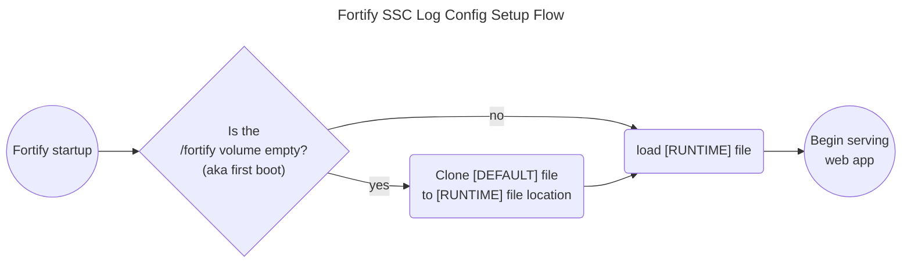

# BigBang custom log4j configuration for Fortify

BigBang offers two modest container logging customizations on top of the Fortify helm chart. The top-level `README` explains the values in detail, but here are the options in plain english:

1. Allow me to change Fortify SSC's root log level from its default of `warn` to something else (`debug`, `info`, etc.)

2. Allow me to opt-in to sending all Fortify SSC logs to `STDOUT`. By default, the Fortify container writes most of its logs to files inside the container and only prints some of that to STDOUT. For a Kubernetes admin, it is often preferable to have your logs go to STDOUT for further processing. ([citation: 12factor.net/logs](https://12factor.net/logs))

## How does Fortify recommend we customize log configurations?

Per the official Fortify docs, we modify the XML config file at `$COM_FORTIFY_SSC_HOME/conf/log4j2.xml`:

> To change the log level setting for Fortify Software Security Center:
> 1. Navigate to `<fortify.home>/<app_context>/conf`, and then open the `log4j2.xml` file
     in a text editor.
> 2. On line 98, change `<Root level="warn">` to `<Root level="debug">`.
> 3. Save and close the file.
>
> The modified configuration takes in approximately 10 seconds (as defined by the value of the
`monitorInterval` attribute in the configuration).
>
> **Note**: You cannot add a new logger and set a level for it. Only changes to existing loggers are picked up dynamically.

Reference: [Fortify 23.2.0 PDF manual](https://www.microfocus.com/documentation/fortify-software-security-center/2320/SSC_Guide_23.2.0.pdf)

## How does Fortify read its logging configuration?

At runtime, Fortify loads its runtime configuration from a file at `$COM_FORTIFY_SSC_HOME/conf/log4j2.xml`.

## Where does `$COM_FORTIFY_SSC_HOME` come from?

This comes to us pre-set in the IronBank `microfocus/fortify/ssc` image. The BigBang `fortify` chart in this repository does not attempt to override this value.

`COM_FORTIFY_SSC_HOME=/fortify/ssc`

## Can we overwrite that file directly with a mounted `ConfigMap`?

Not directly, due to some technical conflicts:

1. Our Fortify chart already mounts a `persistent-volume` at `/fortify`.
2. The target file location `$COM_FORTIFY_SSC_HOME` would be inside the above `/fortify` path.
3. Kubernetes does not allow for the mounting of one volume inside another. (see [relevant k8s `Volumes` docs](https://kubernetes.io/docs/concepts/storage/volumes/#background))

## Can we copy in our own preferred log config to `$COM_FORTIFY_SSC_HOME` at boot with an `initContainer`?

Unfortunately, no, because Fortify will overwrite that file in the special case of a new installation — or any time it decides it's in its "first boot" state.

## Where does Fortify get its default logging config on first boot if our `/fortify` volume is empty?

Fortify copies in a default logging config from `/app/ssc/WEB-INF/init/log4j2.xml`. We *can* override that file with a `Volume` mount backed by our own custom `ConfigMap`.

## Ok, so now that we're overriding the default log config file from `/app/WEB-INF` with a BigBang-specific file from a `ConfigMap`, are we done?

Not quite. Since previous versions of the BigBang fortify chart didn't overwrite this config file, Fortify will have installed the vendor's default logging config at `$COM_FORTIFY_SSC_HOME/conf/log4j2.xml`.

⚠️ This means our new default file mounted at `/app/WEB-INF/init/log4j2.xml` won't be copied over as Fortify sees we already have a config in place.

## So what do we do instead?

Our current solution has more moving parts than we'd like. Here they are.

- BigBang's customized `log4j2.xml` config is built from a helm template with input from `values.yaml` and mounted at the "default" log config location, `/app/WEB-INF/init/log4j2.xml`.
- BigBang adds an `initContainer` to the `fortify-ssc-webapp` `StatefulSet` with exactly one job: **Aggressively delete any existing log config from "runtime" config path at `$COM_FORTIFY_SSC_HOME/conf/log4j2.xml`.
- On *every* boot, Fortify correctly detects that we don't have al og config in place in our `/fortify` persistent volume, and so it helpfully copies in the config we've provided at its expected "default" config from `/app/WEB-INF`.

## Sounds complicated. How do we make sure our custom log config is actually in force?

We've added a BigBang package CI test has been added to [tests/wait.sh](../tests/wait.sh). Its job is to wait for fortify's helm install to finish and then check the runtime log config at `$COM_FORTIFY_SSC_HOME/config/log4j2.xml` to ensure that our custom "this file was put here by BigBang!" test shows up as expected.

## Won't this break awkwardly once a major Fortify upgrade changes the location and contents of their log4j config file handling?

Probably! If you find a better way to manage this, please let us know.