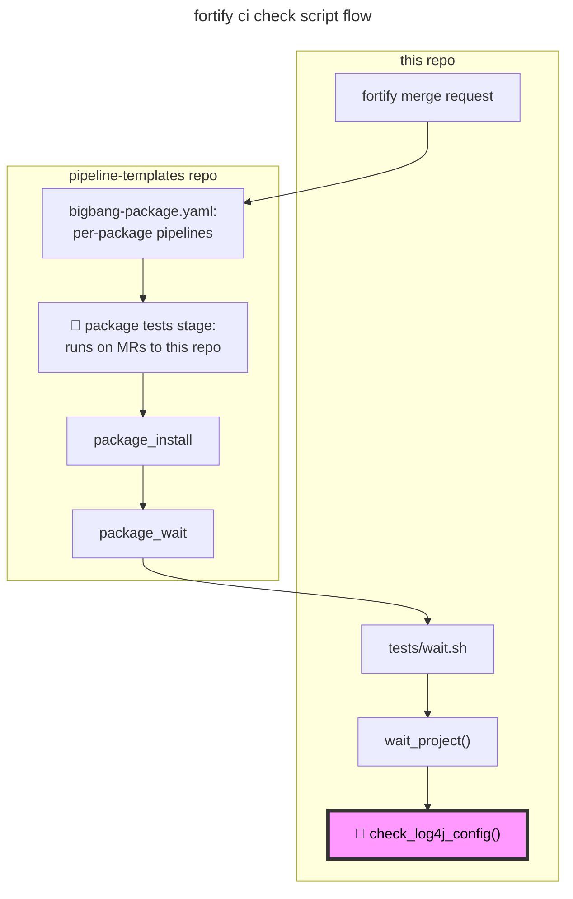

## CI tests for `fortify` package

```mermaid
---
title: fortify ci check script flow
---
flowchart TD
    classDef primary fill:#f9f,stroke:#333,stroke-width:4px,color:black

    subgraph this repo
        tests/wait.sh
        
        mr["fortify merge request"]
        tests/wait.sh --> wait_project["wait_project()"]
        wait_project --> check_log4j_config["🔑 check_log4j_config()"]:::primary
        
        click check_log4j_config href "https://www.github.com" "This is a tooltip for a link"
    end
    
    subgraph pipeline-templates repo
        mr --> bpy["bigbang-package.yaml:\nper-package pipelines"] 
        bpy--> pt[" 🤞 package tests stage:\nruns on MRs to this repo"]
        pt --> package_install
        package_install --> package_wait
        package_wait --> tests/wait.sh
    end
```